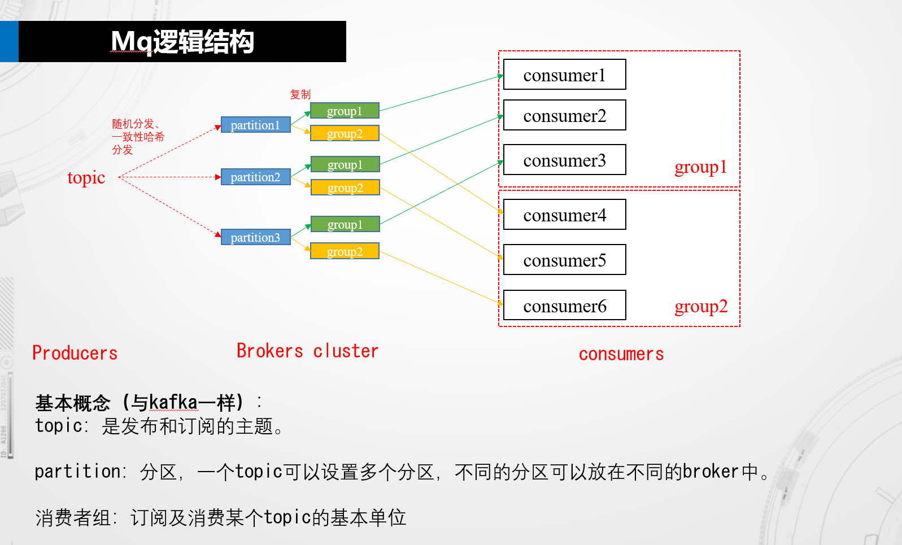
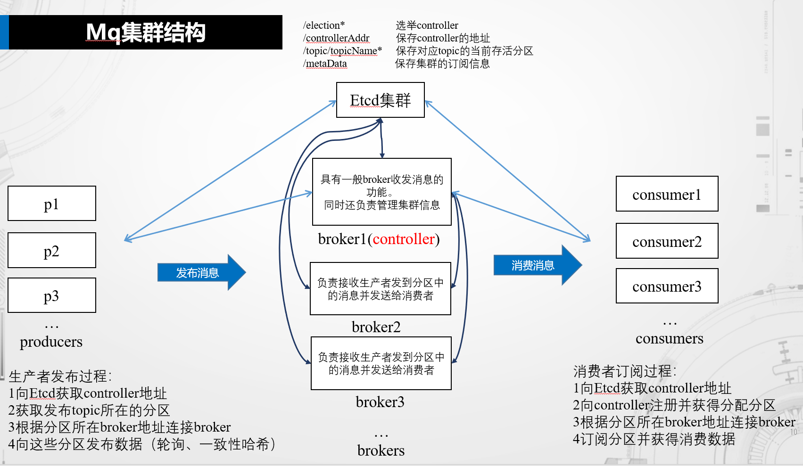
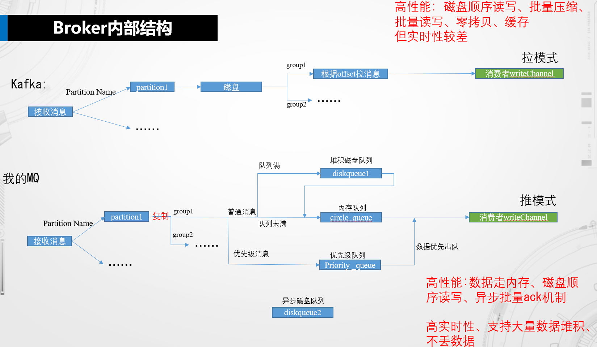

#MQ实现方案

-----
## 1整体设计框架及介绍



以上是我的分布式消息队列设计框架图。框架主要参考了kafka的形式，在kafka的基础上精简了很多东西，但其中的基础概念还是差不多的：

消费者组：每个消费者必须指定所在的消费者组，一个topic上的一条消息只能被消费者组内的其中一个消费者消费（集群消费，如上图中发到topic2的消息只会被group3中的某个消费者消费）。一个topic上的一条消息会同时被不同的消费者组消费（广播消费，如上图中的group1和group2同时消费发到topic1中的所有消息）。

topic：是发布和订阅的主题，发布和订阅消息时，必须指定一个topic。
partition：分区，分区的设计是kafka和rocketMQ可以实现高吞吐量的主要原因。创建topic时需要指定分区数，不同的分区可以放在不同的broker中，消费时会根据消费者组中消费者的数量进行均衡之后将分区分给消费者组中不同的消费者进行消费。为了题目中高性能的要求，这里也采用将topic分区的方式。


## 整个框架主要由以下五部分组成：
1.生产者，生产者发送指定topic的消息到指定partition。如果消费者发送前还没有topic所在的partition和broker信息，它会先通过brokers集群中的其中一个broker获取（每个broker中都保存了集群的全部信息）。发送时，生产者随机选择topic下的某个partition进行发送，实现负载均衡。

2.broker，分为broker controller和普通broker两种角色，每个broker都可以在这两种身份之间切换，选举和切换主要是通过zookeeper中的/controller临时节点实现的。broker 负责接收发到某个分区的消息，并推送到订阅的消费者组，考虑到简单、实时性和高性能，这里直接采用“推”模式。broker controller负责监听zookeeper中集群信息（topic、partion信息、consumers和broker在线情况等）的变化，将集群信息同步到每个broker。controller还可以根据消费者组中的消费者数量将分区均衡分配给不同的消费者。每个broker都会与controller建立连接，普通broker之间不会有连接。

3.消费者。消费者需指定所在的消费者组，向broker订阅指定topic下的partition。若订阅前没有需订阅topic的分区和broker地址，消费者可通过brokers集群中的其中一个broker获取。这个broker会告知controller有新消费者加入，controller将该topic下的partition进行重分配，将分配给该消费者的partion和所在的broker地址告知消费者。和kafka和rocketmq一样，消费者的数量应小于或等于分区数量，否则多出来的消费者将没有分区可消费。

4.zookeeper（或etcd），我参考了kafka和rocketMQ前期的框架，使用开源zookeeper做集群管理。使用zookeeper来进行broker controller的选举、保存集群信息以便于修改和查询集群信息，broker controller监听集群信息进行管理。采用zookeeper的另一主要原因是为了方便后面拓展。后序如果有时间，还可以通过zookeeper实现每个分区的主从模式，以实现broker的高可用。另外也可以通过zookeeper创建临时节点监听broker和consumer的在线情况进行动态分区等。zookeeper使得整个框架非常易于拓展以实现其他的MQ功能（虽然这些功能很可能后续不够时间实现...）

---
--- 

---

# 中期答辩前完成的内容（7.30）

因为中期答辩的时间比较紧，所以打算先实现一个单机的broker controller，在broker controller中先完成简单的发布订阅模型、消息通知机制、优先队列、持久化堆积等功能。

# 1broker内部架构



# 2 broker实现方案

## 2.1broker处理请求

broker需要处理的请求主要有以下5种：

1 生产者请求创建topic和指定数量的分区（response：发回创建好的分区集合）。

2 生产者查询指定topic的分区（response：返回分区集合）。

3 生产者发布消息到指定分区。（response：ack）。

4 消费者查询指定topic下可以订阅的分区（response：返回可以订阅的分区）。

5 消费者请求订阅topic下的某个分区。（response：ack）

请求协议的以int32类型的key开头，由于go中没有enum，所以直接使用const代替。key的类型如下：

```
//request key
const (
	CreatTopic int32 = 0
	GetPublisherPartition = 1
	Publish int32 = 2
	GetConsumerPartition int32 = 3
	Subscribe int32 = 4   
)
```
对应的请求协议如下：

1. CreatTopic + topic + num（int32 + []byte+ int32）

2. GetPublisherPartition + topic（int32 + []byte）

3. Publish + topic + partition + msglen + msg（int32 + []byte+ []byte+ int32 + []byte）

4. GetConsumerPartition + groupName + topic（int32 + []byte+ []byte）

5. Subscribe + topic + partition （int32 + []byte+ []byte）


协议中所有的int32都通过go语言包转化为大端模式进行传输。[]byte为以‘\0’结尾的数组。通过‘\0’解析得到完整的内容。为了后序给消息加上优先级信息，msg可以是一个结构体，提供encode和decode函数成员函数实现和[]byte之间的转化即可。

## 2.1.1创建topic和指定数量的分区实现

根据解析的topic名称和分区数量，new一个topic实例和对应数量的partition实例。每个partition开启一个goroutine来管理。并将新建的partion名称集合和所在brokers地址（方便后序集群扩展）返回给生产者。

## 2.1.2生产者查询指定topic的分区

根据解析的topic名称找到对应的topic实例，返回它的partion集合。

## 2.1.3生产者发布到指定分区的消息

根据解析的topic和分区名称，将消息发送到对应partition实例的channel，返回ack即可。

## 2.1.4消费者获取topic的发布分区

根据broker中topic的数量和groupName中已有的消费者数量进行分区分配。返回分给该消费者的分区集合。

## 2.1.5消费者请求订阅topic下的某个分区

将Partion实例中对应group的channel地址替换为该消费者的读取channel。若Partion中还没有改group，则直接创建一个。这时每条发送到该partition的消息都会被推送到该consumer。

## 2.2 broker发送数据

broker需要发送到客户端的数据主要有以下四种：

1给消费者返回消费分区集合

2推送msg到消费者。

3给生产者或消费者回ack通知。

4给生产者回指定topic的partion集合。

对应的协议如下：

1. dataslen + datas（int32 + []byte）

2. msglen + msg（int32 + []byte）

3. ret（int32，响应码）

4. dataslen + datas（int32 + []byte）

其中分区集合的元素应包括分区名称和它所在的broker地址（方便后序集群扩展）。每个元素为“groupName:broker地址”。元素之间用“ ”进行分隔。因此通过“:”和" "字符进行简单解析即可解析得到每个分区的名称和地址。

# 3生产者实现方案

主要是给用户提供三个接口：

createTopic(topic string, num int32) //创建分区数num的topic。

getProducerPartitionForTopic(topic string) //获取topic的分区集合

publish(topic string, msg []byte，priority int32)//发布优先级为priority的消息到指定topic。轮询该topic的partition进行发送。
细节省略...

# 4消费者实现方案 

getComsumerPartitionForTopic(topic string, groupName string) //提供topic和消费者组名，向broker获取该分配给该消费者的分区集合

subscribe(topic string， handle func)//根据topic订阅broker分配给消费者的所有分区，传入一个接收到数据时的回调函数。

sendReadyNum(num int32)//告诉broker该消费者中最大可接受的消息数。broker不能在发送超过这个数量的消息给consumer。

细节省略...

# 5其它扩展功能

## 5.1 提供RESTful api

在broker中增加一个http服务goroutine。接收到生产者通过http发来的消息。处理方式和tcp发来的数据类似即可。

## 5.2 持久化

实现类似kafka那种每条消息都存储的方案比较困难。需要考虑存储，检索、清理等非常多的内容。但是持久化多数情况下只是为了解决消息堆叠过大，导致内存不够的情况。

因此，我计划的实现方案是只有broker内存中未发送的数据存储不下时，才把新来的发布消息保存到磁盘中，在内存中未发送的数据量减少时，则从磁盘中读出。

## 5.3 优先队列

在每个topic实例中通过一个优先级最大堆保存发送到该topic的消息（当然，只有当消费者的速度跟不上生产者的生产速度时该优先队列才会有效）。

## 5.4集群

待续。


